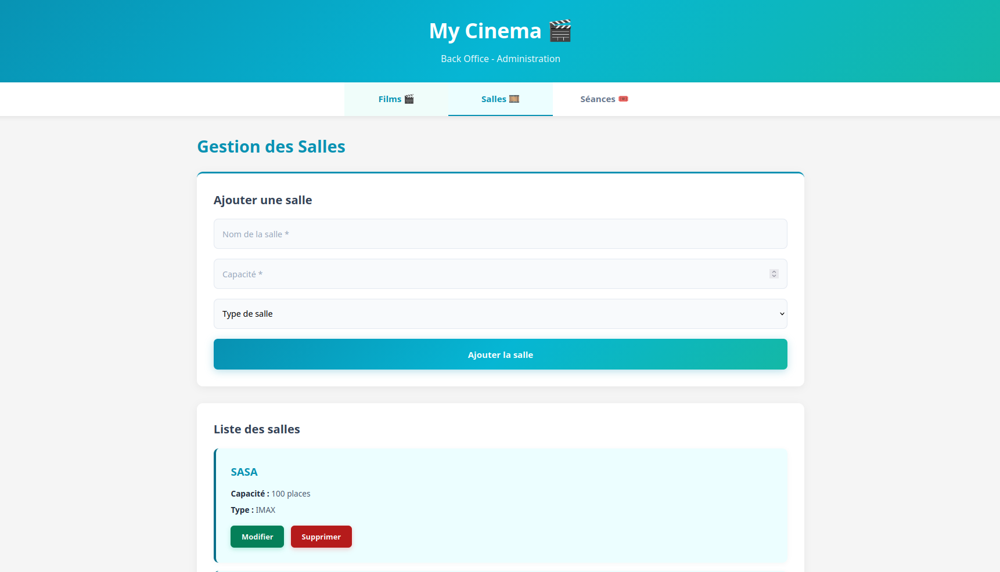
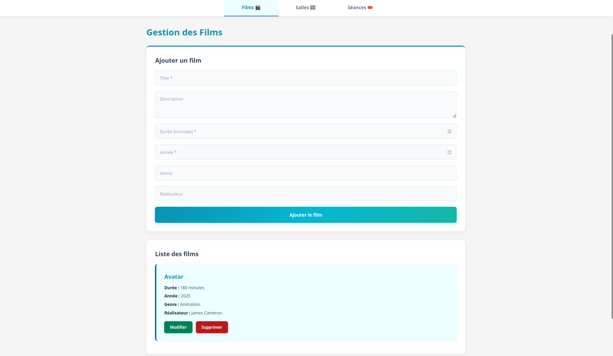
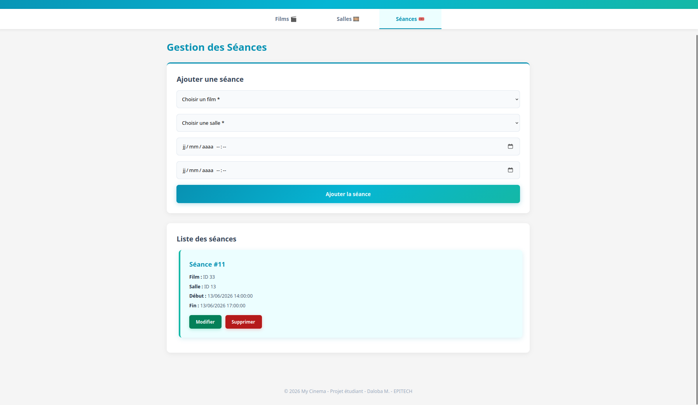
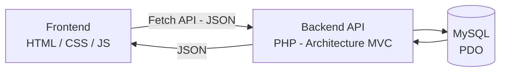

# 🎬 My Cinema - Système de Gestion de Cinéma

Application web de gestion de cinéma permettant d'administrer films, salles et séances.

## 📸 Aperçu du projet

<p align="center">
  
</p>
<table>
  <tr>
    <td width="50%"></td>
    <td width="50%"></td>
  </tr>
  <tr>
    <td align="center"><em>Gestion des films</em></td>
    <td align="center"><em>Gestion des séances</em></td>
  </tr>
</table>

## 🎯 Fonctionnalités

- ✅ **Gestion des films** : CRUD complet (Create, Read, Update, Delete)
- ✅ **Gestion des salles** : CRUD complet avec édition et soft delete
- ✅ **Gestion des séances** : CRUD complet avec édition et vérification automatique des conflits d'horaires
- ✅ **Architecture MVC** : Backend organisé en Models, Repositories, Controllers
- ✅ **API REST JSON** : Communication Frontend ↔ Backend via Fetch API
- ✅ **Pagination** : Affichage des films par pages
- ✅ **Calcul automatique** : L'heure de fin des séances se calcule selon la durée du film

## 🙋 Mon rôle

Projet réalisé **en solo**, de la conception à la mise en production locale :

- Conception de l'architecture MVC (Models, Repositories, Controllers) en PHP natif, sans framework
- Modélisation et création de la base de données MySQL (respect strict du diagramme fourni)
- Développement de l'API REST JSON (CRUD complet pour Films, Salles, Séances)
- Développement du front (HTML/CSS/JS vanilla) consommant l'API via Fetch
- Implémentation de la logique métier (gestion des conflits d'horaires, suppression conditionnelle, soft delete)
- Débogage et correction d'un bug de cohérence base de données (voir section ci-dessous)

## 🛠️ Technologies

**Backend** :
- PHP 8+ (Programmation Orientée Objet)
- MySQL avec PDO (requêtes préparées)
- Architecture MVC

**Frontend** :
- HTML5 / CSS3
- JavaScript (Fetch API)
- Design responsive

## 🏗️ Architecture



## 📦 Installation

### 1. Créer la base de données
```bash
sudo mysql < script.sql
```

### 2. Lancer le serveur backend
```bash
cd backend
php -S localhost:8000
```

### 3. Lancer le serveur frontend
```bash
cd frontend
php -S localhost:3000
```

### 4. Accéder à l'application

Ouvrir dans le navigateur : `http://localhost:3000/index.html`

## 📁 Structure du projet
```
my-cinema/
├── backend/
│   ├── index.php (Point d'entrée API)
│   ├── config/
│   │   └── database.php
│   ├── models/
│   │   ├── Movie.php
│   │   ├── Room.php
│   │   └── Screening.php
│   ├── repositories/
│   │   ├── MovieRepository.php
│   │   ├── RoomRepository.php
│   │   └── ScreeningRepository.php
│   └── controllers/
│       ├── MovieController.php
│       ├── RoomController.php
│       └── ScreeningController.php
├── frontend/
│   ├── index.html
│   ├── style.css
│   └── js/
│       ├── script.js
│       ├── movies.js
│       ├── room.js
│       └── screening.js
├── script.sql
└── README.md
```

## 🎬 Utilisation

### Ajouter un film
1. Aller sur l'onglet "Films"
2. Remplir le formulaire (titre, durée, année...)
3. Cliquer sur "Ajouter le film"

### Modifier un film, une salle ou une séance
1. Cliquer sur le bouton "Modifier" de l'élément concerné
2. Le formulaire se pré-remplit automatiquement avec les données existantes
3. Modifier les champs souhaités
4. Cliquer sur "Enregistrer les modifications" (ou "Annuler" pour revenir en arrière sans valider)

### Créer une séance
1. Aller sur l'onglet "Séances"
2. Sélectionner un film et une salle
3. Choisir l'heure de début
4. L'heure de fin se calcule automatiquement
5. Le système vérifie qu'il n'y a pas de conflit d'horaire

## 🧠 Logique métier importante

### Gestion des conflits de séances
Le système empêche la création de deux séances dans la même salle si leurs horaires se chevauchent (même partiellement). La vérification se fait côté backend via `ScreeningRepository::hasConflict()`, qui compare les plages horaires (`start_time` / `end_time`) de toutes les séances actives de la salle concernée.

### Suppression conditionnelle
- Un **film** ne peut pas être supprimé s'il a des séances actives programmées.
- Une **salle** utilise un système de *soft delete* (`active = FALSE`) plutôt qu'une suppression réelle, pour conserver l'historique des séances passées.

### Un bug corrigé : soft delete vs contrainte de clé étrangère
En testant la suppression d'un film après avoir retiré toutes ses séances actives, la suppression échouait toujours avec l'erreur "séances liées".

En creusant, j'ai trouvé la cause : le *soft delete* des séances ne fait que passer `active` à `FALSE`, sans retirer la ligne de la table. Or la contrainte `FOREIGN KEY (movie_id) REFERENCES movies(id) ON DELETE RESTRICT` bloque la suppression du film dès qu'**une ligne** y fait référence — active ou non. La vérification métier (compter les séances *actives*) passait, mais MySQL refusait quand même le `DELETE` à cause des lignes inactives restantes.

**Correctif** : avant de supprimer un film (une fois confirmé qu'il n'a plus de séance active), les séances soft-deleted associées sont définitivement supprimées, ce qui lève la contrainte sans jamais permettre la suppression d'un film ayant une séance encore active.

## 🔒 Sécurité

- ✅ Requêtes préparées PDO (protection injection SQL)
- ✅ Validation des données côté serveur
- ✅ Foreign keys pour l'intégrité référentielle
- ✅ Soft delete pour les salles

## 👤 Auteur

Daloba M. - EPITECH - 2026

## 📄 Licence

Projet éducatif - EPITECH